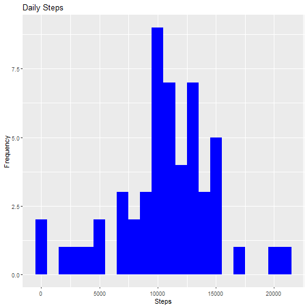
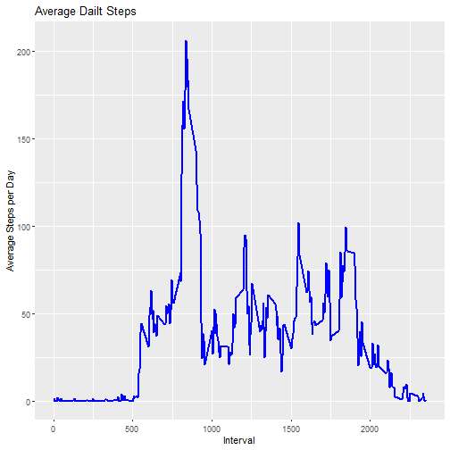
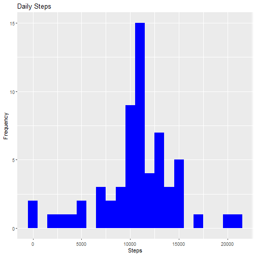
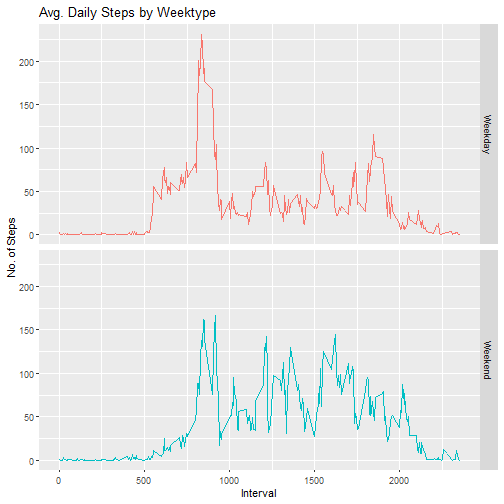

# Importing the required libraries

```r
library(ggplot2)
```

# Loading the Dataset into a dataframe


```r
activity_df <- read.csv(unzip("activity.zip","activity.csv"))
```

# What is mean total number of steps taken per day?

1. Calculate the total number of steps taken per day


```r
total_steps <- aggregate(activity_df$steps~activity_df$date,FUN = sum,na.rm=TRUE)
names(total_steps) <- c('Date','Steps')
head(total_steps,10)
```

```
##          Date Steps
## 1  2012-10-02   126
## 2  2012-10-03 11352
## 3  2012-10-04 12116
## 4  2012-10-05 13294
## 5  2012-10-06 15420
## 6  2012-10-07 11015
## 7  2012-10-09 12811
## 8  2012-10-10  9900
## 9  2012-10-11 10304
## 10 2012-10-12 17382
```

2. Make a histogram of the total number of steps taken each day


```r
g <- ggplot(data = total_steps,aes(Steps))
g + geom_histogram(fill="blue",binwidth = 1000)+
    labs(x="Steps",y="Frequency",title = "Daily Steps")
```



3. Calculate and report the mean and median of the total number of steps taken per day


```r
 paste("Mean Steps : ",mean(total_steps$Steps))
```

```
## [1] "Mean Steps :  10766.1886792453"
```

```r
 paste("Median Steps : ",median(total_steps$Steps))
```

```
## [1] "Median Steps :  10765"
```


# What is the average daily activity pattern?

1. Make a time series plot (i.e. \color{red}{\verb|type = "l"|}type = "l") of the 5-minute interval (x-axis) and the average number of steps taken, averaged across all days (y-axis)


```r
interval_df <- aggregate(activity_df$steps~activity_df$interval,FUN = mean,na.rm=TRUE)
names(interval_df) <- c("Interval","Steps")
g2 <- ggplot(data = interval_df, aes(x = Interval,y = Steps))
g2 + geom_line(color="blue",size = 1) + 
    labs(x="Interval",y="Average Steps per Day",title = "Average Dailt Steps")
```



2. Which 5-minute interval, on average across all the days in the dataset, contains the maximum number of steps?


```r
paste("Interval with maximum Steps : ",interval_df[which.max(interval_df$Steps),"Interval"])
```

```
## [1] "Interval with maximum Steps :  835"
```

# Imputing missing values

1. Calculate and report the total number of missing values in the dataset (i.e. the total number of rows with NAs)


```r
mis_val <- sum(is.na(activity_df))
paste("Total rows with missing value",mis_val)
```

```
## [1] "Total rows with missing value 2304"
```

2. Devise a strategy for filling in all of the missing values in the dataset. The strategy does not need to be sophisticated. For example, you could use the mean/median for that day, or the mean for that 5-minute interval, etc.


```r
paste("Replacing Missing values with mean number of steps at a particular interval. Also rounding off the mean")
```

```
## [1] "Replacing Missing values with mean number of steps at a particular interval. Also rounding off the mean"
```

3. Create a new dataset that is equal to the original dataset but with the missing data filled in.


```r
activity_df_new <- transform(activity_df,steps=ave(steps,interval,
                                               FUN = function(x) replace(x,is.na(x),round(mean(x,na.rm = T)))))
write.csv(activity_df_new,"cleanedData.csv",quote = FALSE)
```

4. Make a histogram of the total number of steps taken each day and Calculate and report the mean and median total number of steps taken per day. Do these values differ from the estimates from the first part of the assignment? What is the impact of imputing missing data on the estimates of the total daily number of steps?


```r
#total steps taken per day
total_steps_new <- aggregate(activity_df_new$steps~activity_df_new$date,FUN = sum,na.rm=TRUE)
names(total_steps_new) <- c('Date','Steps')
```


```r
#Plotting Histogram
g3 <- ggplot(data = total_steps_new,aes(Steps))
g3 + geom_histogram(fill="blue",binwidth = 1000)+
    labs(x="Steps",y="Frequency",title = "Daily Steps")
```




```r
#Mean and median steps per day
paste("Mean Steps : ",mean(total_steps_new$Steps))
```

```
## [1] "Mean Steps :  10765.6393442623"
```

```r
paste("Median Steps : ",median(total_steps_new$Steps))
```

```
## [1] "Median Steps :  10762"
```


```r
#Change in Mean and Median steps
paste("Mean Steps without imputation : ",mean(total_steps$Steps), "and with imputation : ",mean(total_steps_new$Steps))
```

```
## [1] "Mean Steps without imputation :  10766.1886792453 and with imputation :  10765.6393442623"
```

```r
paste("Median Steps without imputation",median(total_steps$Steps), "and with imputation : ",
      median(total_steps$Steps))
```

```
## [1] "Median Steps without imputation 10765 and with imputation :  10765"
```


```r
#Change in number of steps every day
t_steps <- merge(total_steps,total_steps_new,by = "Date",all.y = TRUE)
head(t_steps,10)
```

```
##          Date Steps.x Steps.y
## 1  2012-10-01      NA   10762
## 2  2012-10-02     126     126
## 3  2012-10-03   11352   11352
## 4  2012-10-04   12116   12116
## 5  2012-10-05   13294   13294
## 6  2012-10-06   15420   15420
## 7  2012-10-07   11015   11015
## 8  2012-10-08      NA   10762
## 9  2012-10-09   12811   12811
## 10 2012-10-10    9900    9900
```

# Are there differences in activity patterns between weekdays and weekends?

1. Create a new factor variable in the dataset with two levels – “weekday” and “weekend” indicating whether a given date is a weekday or weekend day.


```r
activity_df_new$day_of_week <- weekdays(as.Date(activity_df_new$date))
activity_df_new$wday_wend <- ifelse(activity_df_new$day_of_week %in% c("Saturday","Sunday"),"Weekend","Weekday")
activity_df_new$wday_wend <- as.factor(activity_df_new$wday_wend)
head(activity_df_new)
```

```
##   steps       date interval day_of_week wday_wend
## 1     2 2012-10-01        0      Monday   Weekday
## 2     0 2012-10-01        5      Monday   Weekday
## 3     0 2012-10-01       10      Monday   Weekday
## 4     0 2012-10-01       15      Monday   Weekday
## 5     0 2012-10-01       20      Monday   Weekday
## 6     2 2012-10-01       25      Monday   Weekday
```

2. Make a panel plot containing a time series plot (i.e. \color{red}{\verb|type = "l"|}type = "l") of the 5-minute interval (x-axis) and the average number of steps taken, averaged across all weekday days or weekend days (y-axis).


```r
interval_df_new <- aggregate(activity_df_new$steps~activity_df_new$interval+activity_df_new$wday_wend,FUN = mean,na.rm=TRUE)
names(interval_df_new) <- c("Interval","wday_wend","Steps")
g4 <- ggplot(data = interval_df_new,aes(x = Interval,y = Steps,color = wday_wend))
g4 + geom_line() + theme(legend.position="none") + facet_grid(wday_wend~.,space = "free") +
    labs(title = "Avg. Daily Steps by Weektype", x = "Interval", y = "No. of Steps")
```


